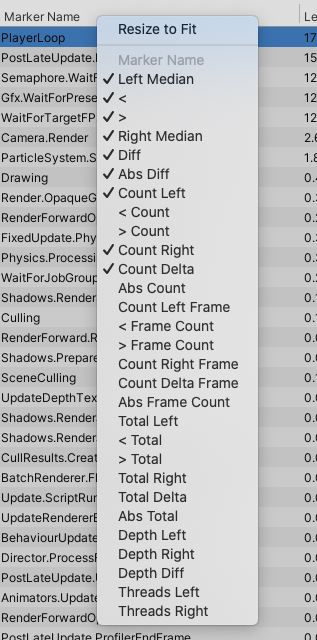
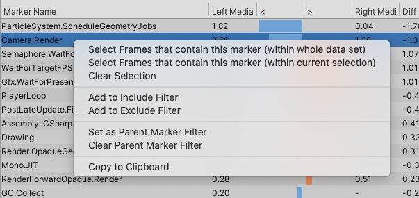

# Compare view

In the **Compare** view you can load two data sets, which the Profiler Analyzer displays in two different colors. It displays the information from both data sets in a similar way to the [Single view](single-view.md) and has the same panes and panels. 

The Compare view is laid out as follows:

 *The Compare view with two data sets loaded.*

|**Pane**|**Description**|
|---|---|
|**A:** Frame control| Displays individual frame timings, ordered by frame index or frame duration for both sets of data. You can also use this pane to select a range of frames for the Profile Analyzer to analyze.   To select the same range on both sets of data, enable **Pair Graph Selection** underneath the charts and then click and drag a selection on either of the charts. For more information on this pane, see the [Frame control](frame-range-selection.md) documentation.|
|**B:** Filters| Use the filter pane to limit the data the Profile Analyzer displays. You can filter by partial match name, thread, or depth slice. You can also exclude markers to remove any markers that aren't relevant from the filtered view. For more information on how to use the filter pane, see the [Filter](filtering-system.md) documentation.|
|**C:** Top 10 markers on median frame| Visualizes the ten highest duration markers that contributed to the frame for both sets of data. You can use this pane to see how the relative costs of markers differ proportionally to each other at the same marker depth. Click any of the markers in this pane to see more information on them.    To adjust how the Profile Analyzer draws the markers against each other, use the **Ratio** dropdown. **Normalised** displays the two data sets relative to their own time at the selected depth. **Longest** displays the absolute difference between the two sets at the selected depth. |
|**D:** Marker Comparison for currently selected range| A sortable list of markers, with detailed information on its timings. For more information, see the [Marker Comparison list](#marker-comparison-list) section of this page.|
|**E:** Frame summary| Displays a summary of frame times. This pane provides useful information if you select a range of frames including the maximum, minimum, upper and lower quartile, mean, and median timings. It also displays the timings as a histogram and box and whisker plot. For more information on the statistics available and how to analyze them, see the documentation on [Statistics in the Profile Analyzer](statistics.md).|
|**F:** Thread summary|Displays information about the threads in the data set. **Total Count** is the total number of threads in the data set, **Unique Count** is the number of unique threads to that data set, and **Selected** is the number of threads you've selected from the data set. To select more threads, see the documentation on the [Thread Window](filtering-system.html#thread-window) in the Filters pane documentation.    There is also a summary of the median run time of the current filtered thread with a box and whisker plot of the thread for each data set. Use the **Graph Scale** dropdown to select a scale for the plot. You can choose from **Median frame time**, **Upper quartile of frame time**, or **Max frame time**.|
|**G:** Marker summary| Summarizes the marker data of the current selected item in the **Marker Details** list. Visualizes the marker's mean frame contribution as a percentage of total time and links to the first occurrence of that marker in the Profiler window.   Use the **Top by frame costs** dropdown to select the number of highest occurrences of this marker to display. If you select a range of frames, the Profile Analyzer displays a histogram and box and whisker plot of the data. It also displays the maximum, minimum, upper and lower quartile, mean, and median timings of the frames, plus the individual maximum and minimum.| 

To load data into the **Compare** view, select the **Pull Data** button in the frame control pane, and the Profile Analyzer pulls in any data in the [Profiler](https://docs.unity3d.com/Manual/Profiler.html) window. Alternatively, select the **Load** button to load Profile Analyzer (.pdata) data you have saved from a previous session. 

>[!NOTE]
>If you select the **Load** option, the data must be in the Profile Analyzer .pdata format. If you have data from the Profiler in the .data file format, open it in the Profiler first, and then select the **Pull Data** button in the Profile Analyzer.

For more information on how to pull data into the Profile Analyzer, see the workflow documentation on [Collecting and viewing data](collecting-and-viewing-data.md).

## Marker Comparison list
The **Marker Comparison** pane contains a sortable list of markers with a number of useful statistics, including the difference between the two sets. The proportional graphs with the `<` and `>` labels visualize the values of each marker, so you can see the difference between the timings of both samples.  

If you select a marker in the list, the **Marker Summary** panel displays in depth information on the marker. Each marker in the list is an aggregation of all the instances of that marker, across all filtered threads and in all ranged frames.

You can filter the columns in the **Marker Comparison** list to a more relevant set. This is particularly useful if you want to filter out irrelevant data when you look for **Time** or **Count** values. To filter the columns, select the **Marker columns** dropdown from the **Filters** pane. For more information on how to filter data, see the [Filters](filtering-system.md) documentation.

### Marker Comparison columns and groups
By default, the **Marker columns** dropdown in the **Filters** pane has six preset column layouts that you can use to adjust the layout of the **Marker Comparison** pane. They are:

* **Time and count:** Displays information on the average timings and number of times the markers were called.
* **Time:** Displays information on the average timings of the markers. 
* **Totals:** Displays information about the total amount of time the markers took on the whole data set.
* **Time with totals:** Displays information about both the average and total times of the markers. 
* **Count totals:** Displays information about the total number of times the markers were called.
* **Count per frame:** Displays information on the average total per frame the markers were called. 
* **Depths:** Displays information on where the markers are in the Hierarchy. For more information, see the documentation on Depth Slices in [Filters pane](filtering-system.html#depth-slice).
* **Threads:** Displays the name of the thread that the markers appear on. For more information, see the documentation on the Thread window in [Filters pane](filtering-system.html#thread-window).

You can also use the **Custom** column layout to select your own custom mix of columns to add to the layout. To do this, right click on the header of any column, and manually enable or disable any of the columns as necessary. 

 *The list of columns you can add to the Marker Comparison pane*

>[!NOTE]
>In this pane, the **Left** label refers to the first data set loaded into the **Frame Control** pane, which is colored blue. The **Right** label refers to the second data set, which is colored orange.

The following table shows the columns that the Profile Analyzer displays when you select that layout.

||**Time and count**| **Time**| **Totals**| **Time with totals**| **Count totals**| **Count per frame** |**Depths**|**Threads**|
|---|---|---|---|---|---|---|---|---|
|**Marker Name**|&#10003;|&#10003;|&#10003;|&#10003;|&#10003;|&#10003;|&#10003;|&#10003;|
|**Left Median**  **Right Median**|&#10003;|&#10003;||&#10003;|||||
|`<`  `>`|&#10003;|&#10003;||&#10003;|||||
|**Diff**|&#10003;|&#10003;|||||||
|**Abs Diff**|&#10003;|&#10003;||&#10003;|||||
|**Count Left**   **Count Right**|&#10003;||||&#10003;||||
|`<` **Count**   `>` **Count**|||||&#10003;||||
|**Count Delta**|&#10003;||||&#10003;||||
|**Abs Count**|||||&#10003;||||
|**Count Left Frame**   **Count Right Frame**||||||&#10003;|||
|`<` **Frame Count**   `>` **Frame Count**||||||&#10003;|||
|**Count Delta Frame**||||||&#10003;|||
|**Abs Frame Count**||||||&#10003;|||
|**Total Left**   **Total Right**|||&#10003;|&#10003;|||||
|`<` **Total**   `>` **Total**|||&#10003;|&#10003;|||||
|**Total Delta**|||&#10003;||||||
|**Abs Total**|||&#10003;|&#10003;|||||
|**Depth Left**   **Depth Right**|||||||&#10003;||
|**Depth Diff**|||||||&#10003;||
|**Threads Left**   **Threads Right**||||||||&#10003;|

The following table explains what each column does:

|**Column**|**Description**|
|---|---|
|**Marker Name**| Displays the name of the marker.|
|**Left Median**   **Right Median** | The sum of activity for the marker. **Left Median** displays the first data set loaded into the **Frame Control** pane, colored blue. **Right Median** displays the second data set loaded into the **Frame Control** pane, colored orange.|
|`<`   `>`|A visual representation of the **Left Median** (`<`) and **Right Median** (`>`) data.|
|**Diff**|The difference between the summed values in each data set. Negative values mean that the left (blue) set of data is bigger, positive means the right (orange) set of data is bigger.|
|**Abs Diff**|The absolute difference between the summed values in each data set.|
|**Count Left** **Count Right**|The number of times the marker started or stopped. **Count Left** displays the first data set loaded into the **Frame Control** pane, colored blue. **Count Right** displays the second data set loaded into the **Frame Control** pane, colored orange.|
|`<` **Count**   `>` **Count**|A visual representation of the **Count Left** and **Count Right** data.|
|**Count Delta**|The difference between the **Count** values in each data set. Negative values mean that the left (blue) set of data is bigger, positive means the right (orange) set of data is bigger.|
|**Abs Count**|The absolute difference between the **Count** values for the selected frames. Negative values mean that the left (blue) set of data is bigger, positive means the right (orange) set of data is bigger.|
|**Count Left Frame**   **Count Right Frame**| The average count of the marker over all non-zero frames. **Count Left Frame** displays the first data set loaded into the **Frame Control** pane, colored blue. **Count Right Frame** displays the second data set loaded into the **Frame Control** pane, colored orange.|
|`<` **Frame Count**   `>` **Frame Count**|A visual representation of the **Count Left Frame** and **Count Right Frame** data.|
|**Count Delta Frame**|The difference between the **Count Left Frame** and **Count Right Frame** values. Negative values mean that the left (blue) set of data is bigger, positive means the right (orange) set of data is bigger.|
|**Abs Frame Count**|The absolute difference between the number of times the marker started or stopped in each data set.|
|**Total Left**   **Total Right**|The total time for the marker over the selected frames. **Total Left** displays the first data set loaded into the **Frame Control** pane, colored blue. **Total Right** displays the second data set loaded into the **Frame Control** pane, colored orange.|
|`<` **Total**   `>` **Total**|A visual representation of the **Total Left** and **Total Right** data.|
|**Total Delta**|The difference between the total times over the selected frames in each data set. Negative values mean that the left (blue) set of data is bigger, positive means the right (orange) set of data is bigger.|
|**Abs Total**|The absolute difference between the total times over all of the selected frames in each data set.|
|**Depth Left**   **Depth Right**|The level, or depth, that the marker appears at. The marker might appear on multiple depth levels. **Depth Left** displays the first data set loaded into the **Frame Control** pane, colored blue. **Depth Right** displays the second data set loaded into the **Frame Control** pane, colored orange.|
|**Depth Diff**|The difference between the **Depth Left** and **Depth Right** values.|
|**Threads Left**   **Threads Right**|The name of the thread that the marker appears on. **Threads Left** displays the first data set loaded into the **Frame Control** pane, colored blue. **Threads Right** displays the second data set loaded into the **Frame Control** pane, colored orange.|

### Marker Comparison context menu commands
If you right-click on a marker in the **Marker Comparison** list you can control the filter and list even further.

 *The context menu of the Marker Comparison pane*

|**Command**|**Function**|
|---|---|
|**Select Frames that contain this marker (within whole data set)**| Select all the frames from the entire data set that contain an instance of this marker.|
|**Select Frames that contain this marker (within current selection)**| Select all the frames from a selected range of data that contain an instance of this marker.|
|**Clear Selection**| Clear any range selection.|
|**Add to / Remove From Include Filter**| Add or remove the selected marker to the **Include** filter. This filters the marker list to only markers that match.|
|**Add to Exclude Filter**| Add the selected marker to the **Exclude** filter. This removes the marker from the marker list. This is useful if you want to remove markers that are using up resources and skewing the markers that you are interested in.|
|**Set as Parent Marker Filter**| Limit the analysis to this marker and markers included below it on the callstack. For more information, see the [Parent Marker](filtering-system.html#parent-marker) documentation on the Filters page.|
|**Clear Parent Marker Filter**| Select this to clear the marker as a parent marker filter.|
|**Copy To Clipboard**| Copies the selected value to the clipboard.|