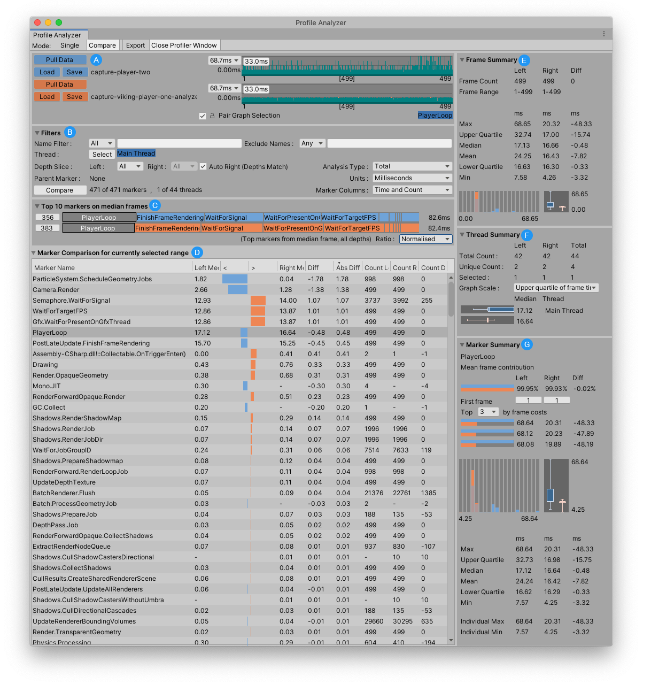

# About the Profile Analyzer package

The Profile Analyzer aggregates and visualizes frame and marker data from a set of [Unity Profiler](https://docs.unity3d.com/Manual/Profiler.html) frames to help you understand their behavior. You can use the Profile Analyzer to compare two sets of data side-by-side, which complements the single frame analysis already available in the Unity Profiler.

For information on how to use the Profile Analyzer, see the documentation on the [Profile Analyzer window](profile-analyzer-window.md)

 *The Profile Analyzer window, with two sets of data loaded*

## Installing the Profile Analyzer

To install this package into versions of Unity that support the package manager follow the instructions in the [Package Manager documentation](https://docs.unity3d.com/Documentation/Manual/upm-ui-quick.html).

When using any Unity version newer than 2021.2.0a5, you can just click __[this link to install it by name](com.unity3d.kharma:upmpackage/com.unity.performance.profile-analyzer)__.

## Requirements

This version of the Profile Analyzer is compatible with the following versions of the Unity Editor:

* 2020.3 and later

For earlier versions, follow this link to the Profile Analyzer [download](https://download.packages.unity.com/com.unity.performance.profile-analyzer/-/com.unity.performance.profile-analyzer-1.1.1.tgz) and place the contents into your Project's Assets folder.

## Known limitations

The Profile Analyzer has the following known limitations:

* The original Profile data is not saved in the Profile Analyzer .pdata file. Therefore, you should store both the Unity Profiler .data file (or the .raw file exported from a stand alone player) along with the .pdata file.
* When you click on a marker, the Profile Analyzer attempts to jump to the same marker in the Unity Profiler if the same data is loaded. You must make a selection in the Unity Profiler beforehand for this to work. In the Unity Profiler in the UI view, the vertical height is not correct.
