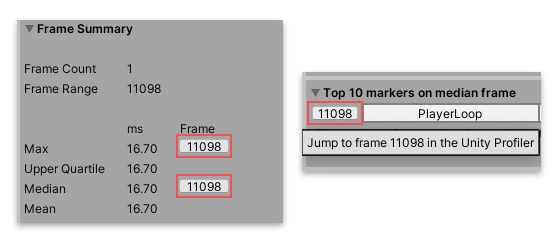

# Profile Analyzer window

The Profile Analyzer window visualizes frame, thread, and marker data from the [Unity Profiler](https://docs.unity3d.com/Manual/Profiler.html) window. It has two views: **Single**, and **Compare**. The [Single view](single-view.md) displays one set of Profiler data. In the [Compare view](compare-view.md), you can load two sets of Profiler data to compare. In both views, the Profile Analyzer displays min, max, median, mean, and lower/upper quartile values of the selected frame range. It also displays information on the distribution of each profiler marker in a histogram and box and whisker plots.

To open the Profile Analyzer window, in the Unity Editor go to menu: **Window &gt; Analysis &gt; Profile Analyzer**.

 *The Profile Analyzer window on start up, with no data loaded.*

## Window navigation
The Profile Analyzer window has the following controls across both views, which you can access at the top of the window:

|**Control**|**Function**|
|---|---|
|**Single**|Enter the [Single view](single-view.md) mode. This is the default view mode.|
|**Compare**|Enter the [Compare view](compare-view.md) mode. You can compare two sets of profiling data in this mode.|
|**Export**|Export the data into a .csv format. When you click this button, a dialog box opens and you can choose from **Marker table**, which exports the marker data visible in [Single view](single-view.md) **Single Frame Times**, which exports the frame data visible in the Single view, or **Comparison Frame Times**, which exports both sets of data visible in the [Compare view](compare-view.md). This button is disabled if you haven't imported any data into the Profile Analyzer window.|
|**Open Profiler Window**|Click this button to open the [Profiler window](https://docs.unity3d.com/Manual/ProfilerWindow.html). When the Profiler window is open, this button changes to **Close Profiler Window**.|

If the data you analyze in the Profile Analyzer is also loaded into the Profiler window, you can click on the frame buttons in the Profile Analyzer window to jump to the relevant frames in the Profiler. 

 *Two examples of the frame buttons in the Profile Analyzer. On the left, frame buttons in the Frame Summary pane. On the right, a frame button with its tooltip displayed.*

## Pulling and analyzing performance data
The Profile Analyzer only analyzes CPU data. It can either analyze data from the active set of frames loaded into the Profiler, or from a saved Profile Analyzer .pdata file. 

The Profile Analyzer aggregates the activity of each marker, and generates useful statistics to help you analyze the marker costs over a number of threads and frames. This includes summing the runtime and counts of each occurrence of every marker for all active threads and frames the Profile captured.

### Pulling data from the Profiler window
To pull data from an active profiling session, click the **Pull Data** button. This pulls in the current set of available frames from the Profiler and visualizes the analyzed results.

If you don't have an active profile session, click the **Open Profiler Window** button, then load or record some data.

### Loading and saving a data set
You can save or reload any data that the Profile Analyzer analyzes at any point in time. This means you can share your analysis with others and load the results into the **Single** or **Compare** view at any time. To save the data from the Profile Analyzer, click the **Save** button in any view. This saves the data in the .pdata format. To load this data, click the **Load** button in any view.

>[!NOTE]
>If you select the **Load** option, the data must be in the Profile Analyzer .pdata format. If you have data from the Profiler in the .data file format, open it in the Profiler first, and then select the **Pull Data** button in the Profile Analyzer.

For more information on how to pull data into the Profile Analyzer, see the workflow documentation on [Collecting and viewing data](collecting-and-viewing-data.md).

## Frame Range Selection
You can limit the analysis to a subset of frames. To do this, select a range in the Frame Control pane at the top of the **Single** and **Compare** views. For more information on using the frame range pane, see the [Frame Control pane](frame-range-selection.md) documentation.

## Filtering
You can also filter the data to limit the number of markers the Profile Analyzer displays. This includes filtering by thread, call depth and name substrings. You can order the remaining markers by any of the available metrics in the marker list control. For more information on how to use the filter system, see the [Filters pane](filtering-system.md) documentation.