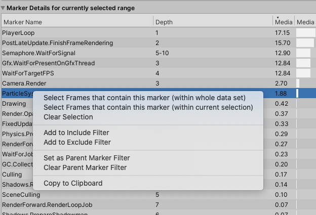

# Single view

The **Single** view displays information about a single set of profiling data. You can use it to analyze how markers perform across frames. The view is divided into several frames, which contain information on frame timings, as well as min, max, median, mean, and lower / upper quartile values for frames, threads, and markers. 

The Single view is laid out as follows:

  *The Single view in the Profile Analyzer window, with some data loaded*

|Pane|Description|
|---|---|
|**A:** Frame control| Displays individual frame timings, ordered by frame index or frame duration. You can also use this pane to select a range of frames for the Profile Analyzer to analyze. For more information on this pane, see the [Frame control](frame-range-selection.md) documentation.|
|**B:** Filters| Use the filter pane to limit the data the Profile Analyzer displays. You can filter by partial match name, thread, or depth slice. You can also exclude markers to remove any markers that aren't relevant from the filtered view. For more information on how to use the filter pane, see the [Filter](filtering-system.md) documentation.|
|**C:** Top 10 markers on median frame| Visualizes the ten highest duration markers that contributed to the frame. You can select any of the markers in this pane to see more information on them. The Profile Analyzer reflects changes you make to the depth filter in this pane. |
|**D:** Marker details for currently selected range| A sortable list of markers, with detailed information on its timings. For more information, see the [Marker details list](#marker-details-list) section of this page.|
|**E:** Frame summary| Displays a summary of frame times. This pane provides useful information if you select a range of frames including the maximum, minimum, upper and lower quartile, mean, and median timings. It also displays the timings as a histogram and box and whisker plot. For more information on the statistics available and how to analyze them, see the documentation on [Statistics in the Profile Analyzer](statistics.md).|
|**F:** Thread summary|Displays information about the threads in the data set. **Total Count** is the total number of threads in the data set, and **Selected** is the number of threads you've selected from the data set. To select more threads, see the documentation on the [Thread Window](filtering-system.html#thread-window) in the Filters pane documentation.    There is also a summary of the median run time of the current filtered thread with a box and whisker plot of the thread. Use the **Graph Scale** dropdown to select a scale for the plot. You can choose from **Median frame time**, **Upper quartile of frame time**, or **Max frame time**.|
|**G:** Marker summary| Summarizes the marker data of the current selected item in the **Marker Details** list. Visualizes the marker's mean frame contribution as a percentage of total time, and links to the first occurrence of that marker in the Profiler window.   Use the **Top by frame costs** dropdown to select the number of highest occurrences of this marker to display. If you select a range of frames, the Profile Analyzer displays a histogram and box and whisker plot of the data. It also displays the maximum, minimum, upper and lower quartile, mean, and median timings of the frames, plus the individual maximum and minimum.| 

To load data into the **Single** view, select the **Pull Data** button in the frame control pane, and the Profile Analyzer pulls in any data in the [Profiler](https://docs.unity3d.com/Manual/Profiler.html) window. Alternatively, select the **Load** button to load Profile Analyzer (.pdata) data you have saved from a previous session. 

>[!NOTE]
>If you select the **Load** option, the data must be in the Profile Analyzer .pdata format. If you have data from the Profiler in the .data file format, open it in the Profiler first, and then select the **Pull Data** button in the Profile Analyzer.

For more information on how to pull data into the Profile Analyzer, see the workflow documentation on [Collecting and viewing data](collecting-and-viewing-data.md).

## Marker details list
The **Marker details** pane contains a sortable list of markers with a number of useful statistics. If you select a marker in the list, the **Marker Summary** panel displays in depth information on the marker. Each marker in the list is an aggregation of all the instances of that marker, across all filtered threads and in all ranged frames.

You can filter the columns in the **Marker details** to a more relevant set. This is particularly useful if you want to filter out irrelevant data when you look for **Time** or **Count** values.  To filter the columns, select the **Marker columns** dropdown from the **Filters** pane.  For more information on how to filter data, see the [Filters](filtering-system.md) documentation.

### Marker details columns and groups
By default, the **Marker columns** dropdown in the **Filters** pane has six preset column layouts that you can use to adjust the layout of the **Marker details** pane. They are:

* **Time and count:** Displays information on the average timings and number of times the markers were called.
* **Time:** Displays information on the average timings of the markers. 
* **Totals:** Displays information about the total amount of time the markers took on the whole data set.
* **Time with totals:** Displays information about both the average and total times of the markers. 
* **Count totals:** Displays information about the total number of times the markers were called.
* **Count per frame:** Displays information on the average total per frame the markers were called. 
* **Depths:** Displays information on where the markers are in the Hierarchy. For more information, see the documentation on Depth Slices in [Filters pane](filtering-system.html#depth-slice).
* **Threads:** Displays the name of the thread that the markers appear on. For more information, see the documentation on the Thread window in [Filters pane](filtering-system.html#thread-window).

You can also use the **Custom** column layout, to select your own custom mix of columns to add to the layout. To do this, right-click on the header of any column, and manually enable or disable any of the columns as necessary. 

 *The list of columns you can add to the Marker Details pane*

The following table shows the columns that the Profile Analyzer displays when you select that layout.

||**Time and count**|**Time**|**Totals**|**Time with totals**|**Count totals**|**Count per frame**|**Depths**|**Threads**|**Custom only**|
|---|---|---|---|---|---|---|---|---|---|
|**Marker Name**|&#10003;|&#10003;|&#10003;|&#10003;|&#10003;|&#10003;|&#10003;|&#10003;||
|**Depth**|&#10003;|&#10003;|&#10003;|&#10003;|&#10003;|&#10003;|&#10003;|||
|**Median**|&#10003;|&#10003;||&#10003;||||||
|**Median Bar**|&#10003;|&#10003;||&#10003;||||||
|**Mean**|&#10003;|||||||||
|**Min**|&#10003;|&#10003;||&#10003;||||||
|**Max**|&#10003;|&#10003;||&#10003;||||||
|**Range**|&#10003;|&#10003;||&#10003;|||||
|**Count**|&#10003;||||&#10003;|||||
|**Count Bar**|||||&#10003;|||||
|**Count Frame**|&#10003;|||||&#10003;||||
|**Count Frame Bar**||||||&#10003;||||
|**1st**|||||||&#10003;||||
|**At Median Frame**|&#10003;|&#10003;||&#10003;||||||
|**Total**|||&#10003;|&#10003;||||||
|**Total Bar**|||&#10003;|&#10003;||||||
|**Threads**||||||||&#10003;||

The following table explains what each column does:

|**Column**|**Description**|
|---|---|
|**Marker Name**| Displays the name of the marker.|
|**Depth**|The depth in the hierarchy that the marker appears on.|
|**Median**| The median value of the marker's time distribution.|
|**Median Bar**| A visualization of the **Median** value.|
|**Mean**| The average value of the marker's time distribution.|
|**Min**| The minimum value of the marker's time distribution.|
|**Max**| The maximum value of the marker's time distribution.|
|**Range**| The difference between the marker's **Min** and **Max** timings.|
|**Count**| The number of times the marker was pushed / popped.|
|**Count Bar**|A visualization of the **Count** value. |
|**Count Frame**|The average number of times per frame that the marker was pushed/popped.|
|**Count Frame Bar**|A visualization of the **Count Frame** value.|
|**1st**| The frame number in which the marker first was pushed / popped.|
|**At Median Frame**| The sum of activity for the marker in the median frame.|
|**Total**| The total time spent for this marker in all selected frames.|
|**Total Bar**|A visualization of the **Total** value.|
|**Thread**|The name of the thread that the marker appears on.|

### Marker Details context menu commands
If you right click on a marker in the **Marker Details** list you can control the filter and list even further.

 *The context menu of the Marker Details pane*

|**Command**|**Function**|
|---|---|
|**Select Frames that contain this marker (within whole data set)**| Select all the frames from the entire data set that contain an instance of this marker.|
|**Select Frames that contain this marker (within current selection)**| Select all the frames from a selected range of data that contain an instance of this marker.|
|**Clear Selection**| Clear any range selection.|
|**Add to / Remove From Include Filter**| Add or remove the selected marker to the **Include** filter. This filters the marker list to only markers that match.|
|**Add to / Remove From Exclude Filter**| Add the selected marker to the **Exclude** filter. This removes the marker from the marker list. This is useful if you want to remove markers that are using up resources and skewing the markers that you are interested in.|
|**Set as Parent Marker Filter**| Limit the analysis to this marker and markers included below it on the callstack. For more information, see the [Parent Marker](filtering-system.html#parent-marker) documentation on the Filters page.|
|**Clear Parent Marker Filter**| Select this to clear the marker as a parent marker filter.|
|**Copy To Clipboard**| Copies the selected value to the clipboard.|